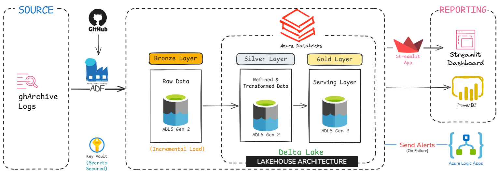
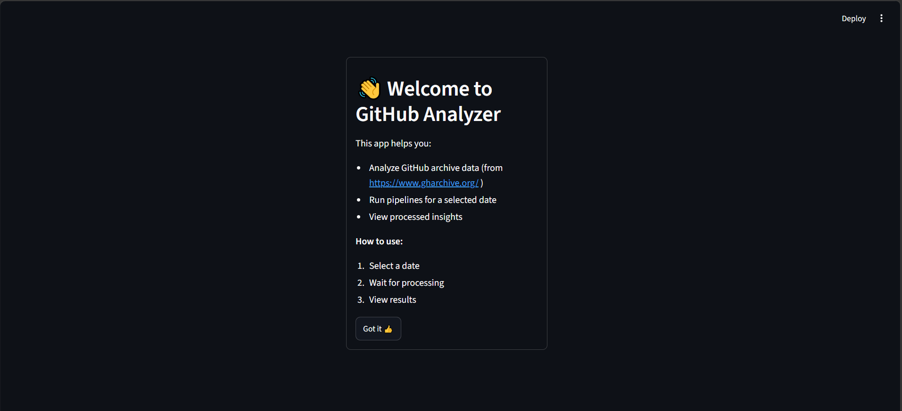
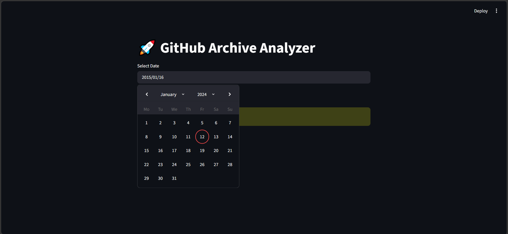
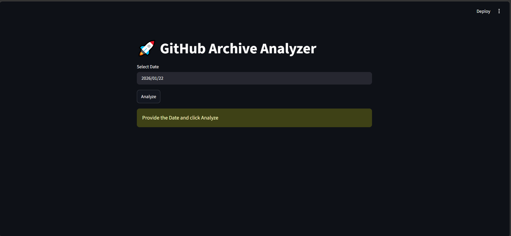
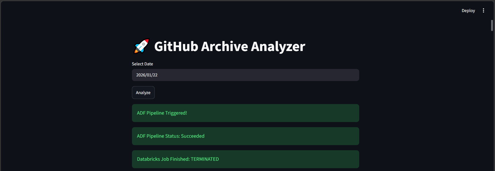
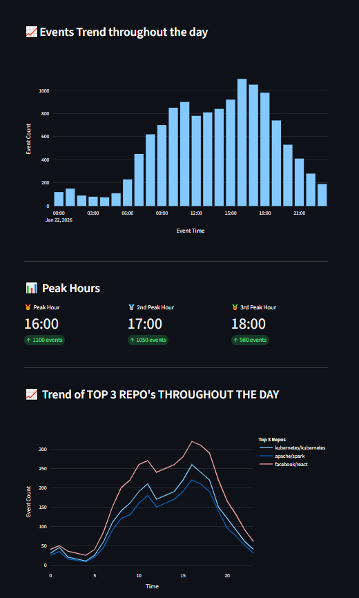
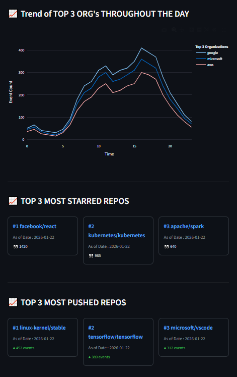
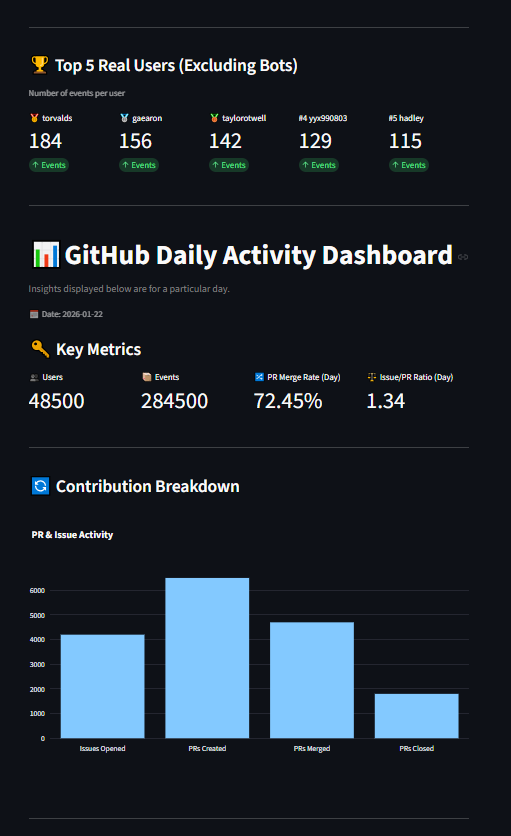
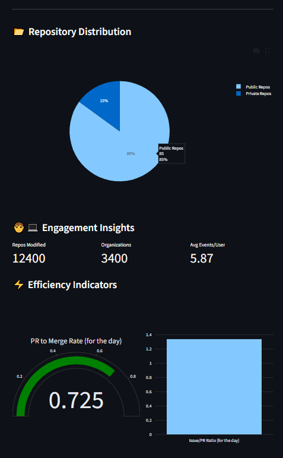

# 🚀 GitHub Analyzer — Enterprise Lakehouse Analytics Pipeline

An end-to-end, cloud-native data engineering project that ingests raw GitHub public event data (via [GH Archive](https://www.gharchive.org/)), processes it through a **Medallion (Bronze-Silver-Gold) Lakehouse architecture** on Azure, and serves the results through a self-service, interactive **Streamlit** analytics dashboard.

This project simulates a real-world enterprise data platform — covering orchestration, distributed data processing, Delta Lake table design, REST API integration, and front-end data visualization.

---

## 📌 Table of Contents

- [Overview](#-overview)
- [Architecture](#-architecture)
- [Key Features](#-key-features)
- [Tech Stack](#-tech-stack)
- [Project Structure](#-project-structure)
- [Data Flow — Medallion Architecture](#-data-flow--medallion-architecture)
- [Gold Layer Tables](#-gold-layer-tables)
- [Dashboard Preview](#-dashboard-preview)
- [Author](#-author)

---

## 📖 Overview

Every hour, GitHub generates millions of public events (pushes, pull requests, issues, stars, etc.), which are published as raw JSON archives by GH Archive. **GitHub Analyzer** automates the full lifecycle of this data:

1. **Ingests** raw hourly event data into a cloud data lake.
2. **Cleans, flattens, and models** it into a structured Lakehouse using Spark.
3. **Aggregates** it into business-ready analytical tables.
4. **Visualizes** it through an interactive, self-triggered dashboard — with live pipeline status tracking.

---

## Problem Statement

Modern software organizations generate massive amounts of activity data through platforms like GitHub, including repository events, commits, pull requests, issues, and developer interactions. However, raw event logs are complex, nested, and difficult to analyze directly.

The goal was to build a data platform capable of:
- Automating ingestion of GitHub activity data
- Processing large volumes of JSON-based event data
- Applying scalable transformations
- Creating analytics-ready datasets
- Providing engineering insights through dashboards

---

## 🏗 Architecture


**High-level flow:**

```
GH Archive (Source)
        │
        ▼
Azure Data Factory (Orchestration)
   ├── ForEach Hour (0–23) → Copy Activity
   ▼
Azure Data Lake Storage Gen2 — Bronze Layer (Raw JSON)
        │
        ▼  (triggers via REST API)
Azure Databricks (PySpark)
   ├── Silver Layer → Cleaned, deduplicated, flattened Delta table
   ▼
   ├── Gold Layer → 9+ partitioned, aggregated Delta tables
        │
        ▼  (Databricks SQL Warehouse)
Streamlit Dashboard (Front-End)
   ├── Triggers & polls ADF / Databricks pipeline runs
   ├── Queries Gold Delta tables
   └── Renders interactive Plotly visualizations

Azure Logic Apps → Email alerts on pipeline Success / Failure
```

---

## ✨ Key Features

- ⏱ **Automated hourly ingestion** of GitHub event data using parameterized, parallelized ADF pipelines (`ForEach` loop over 24 hours/day).
- 🧱 **Medallion Lakehouse architecture** (Bronze → Silver → Gold) built with PySpark and Delta Lake on Databricks.
- 🔗 **Pipeline-to-pipeline orchestration** — ADF triggers Databricks jobs via REST API and tracks run IDs.
- 📧 **Automated alerting** via Azure Logic Apps on pipeline success/failure.
- ⚡ **Cache-first / idempotent triggering** — the dashboard checks if data already exists in the lake before re-running the pipeline, avoiding redundant compute.
- 📊 **Self-service analytics dashboard** built in Streamlit with real-time pipeline status polling and 10+ interactive Plotly visualizations (trend lines, gauges, KPI cards, leaderboards).
- 🧮 **Derived business KPIs** — PR merge rate, issue-to-PR activity ratio, trending repos/orgs per hour using Spark window functions.
- 🔐 **Secure, service-principal based authentication** (Azure AD OAuth2 client credentials flow) for all Azure REST API calls.

---

## 🛠 Tech Stack

| Layer | Technology |
|---|---|
| Orchestration | Azure Data Factory (ADF) |
| Storage | Azure Data Lake Storage Gen2 (ADLS Gen2) |
| Processing / Transformation | Azure Databricks, PySpark |
| Table Format | Delta Lake |
| Query Engine | Databricks SQL Warehouse |
| Alerting | Azure Logic Apps |
| Authentication | Azure AD (Service Principal / OAuth2 Client Credentials) |
| Front-End / Dashboard | Streamlit, Plotly, Matplotlib, Pandas |
| Language | Python |
| Data Source | [GH Archive](https://www.gharchive.org/) |

---

## 📂 Project Structure

```
Github_Analyzer/
│
├── ADF/                                # Azure Data Factory artifacts
│   ├── dataset/
│   │   ├── ds_sourc_gh_archive.json    # Source dataset (GH Archive HTTP)
│   │   └── ds_target_adls_lake.json    # Target dataset (ADLS Gen2 - Bronze)
│   ├── linkedService/
│   │   ├── ls_gh_archive.json          # Linked service for GH Archive
│   │   └── ls_datelake.json            # Linked service for ADLS Gen2
│   ├── pipeline/
│   │   └── github_analyzer_daily_pipeline.json   # Main orchestration pipeline
│   └── factory/
│       └── adfspotifyazureprj.json     # ADF factory definition
│
├── Databricks/                         # PySpark transformation notebooks
│   ├── silver_trans.py                 # Bronze → Silver (clean, dedupe, flatten)
│   ├── gold_trans.py                   # Silver → Gold (aggregations & KPIs)
│   └── utils.py                        # Shared helper functions
│
├── Streamlit App/                      # Front-end dashboard
│   ├── main.py                         # Streamlit app entry point
│   ├── utils.py                        # API triggers, polling, chart rendering
│   └── requirements.txt                # Python dependencies
│
├── assets/
│   └── architecture.png                # 📌 Add your architecture diagram here
│
└── README.md
```

---

## 🔄 Data Flow — Medallion Architecture

### 🥉 Bronze Layer — Raw Ingestion
- ADF's `ForEachHour` activity loops through 24 hourly GH Archive files (`YYYY-MM-DD-H.json.gz`) for a given date and copies them as-is into ADLS Gen2 (`bronze/{date}/`).
- No transformation — preserves raw source fidelity for reprocessing/auditing.

### 🥈 Silver Layer — Cleaned & Modeled
- Reads all raw JSON files for a given date from the Bronze layer.
- Drops duplicate events (by `id`) and null-checks critical fields (`id`, `type`, `actor.login`, `repo.name`, `payload`).
- Flattens deeply nested JSON (`actor`, `repo`, `org`, `payload.pull_request`, `payload.issue`, `payload.comment`) into a clean tabular schema.
- Adds partitioning columns (`year`, `month`, `day`) and writes as a partitioned Delta table (`silver.silver_raw`).

### 🥇 Gold Layer — Business-Ready Aggregates
- Reads Silver data for the target date and computes 9+ curated, analytics-ready Delta tables — including hourly trends, top contributors, repo/org rankings, and derived KPIs (detailed below).

---

## 🏆 Gold Layer Tables

| Table | Description |
|---|---|
| `event_hour_distribution` | Pivoted count of each event type, per hour of the day |
| `total_events_per_hour` | Total GitHub events generated per hour |
| `total_diff_events` | Count of events grouped by event type |
| `top_10_real_users` | Top 10 most active users that day (bots excluded), ranked using window functions |
| `top_3_repo_trend` | Hourly activity trend of the top 3 most active repos |
| `top_3_org_trend` | Hourly activity trend of the top 5 most active organizations |
| `most_starred_repos` | Top 5 repos by `WatchEvent` (star) count |
| `top_3_repos_by_pushes` | Top 3 repos ranked by `PushEvent` count |
| `overview_table` | Daily KPI summary — unique users, public/private repo split, PR merge rate, issue-to-PR activity ratio |

---

## 📸 Dashboard Preview

<!-- 
    📌 Optional: Add dashboard screenshots here once available
    Example:
    
-->

The Streamlit dashboard displays:
- 📈 Daily event trend charts
- 🕐 Peak activity hours
- 🏆 Top 5 contributors leaderboard (bot-filtered)
- ⭐ Most starred & most active repos (styled cards)
- 🔀 PR merge rate & Issue-to-PR ratio gauges
- 📂 Public vs. Private repo distribution









---

> **⚠️ Note**
>
> This project was developed and demonstrated using Azure's free trial subscription. The trial has since expired, and the associated Azure resources (Azure Data Factory, ADLS Gen2, Databricks, etc.) have been decommissioned. As a result, the live application and pipeline are no longer operational. However, the complete source code, project structure, architecture, and screenshots are available in this repository for reference.

---

## 👤 Author

**Siddhesh B N**
🔗 [GitHub](https://github.com/Siddheshbn)

---

⭐ If you found this project interesting, consider giving it a star on GitHub!
